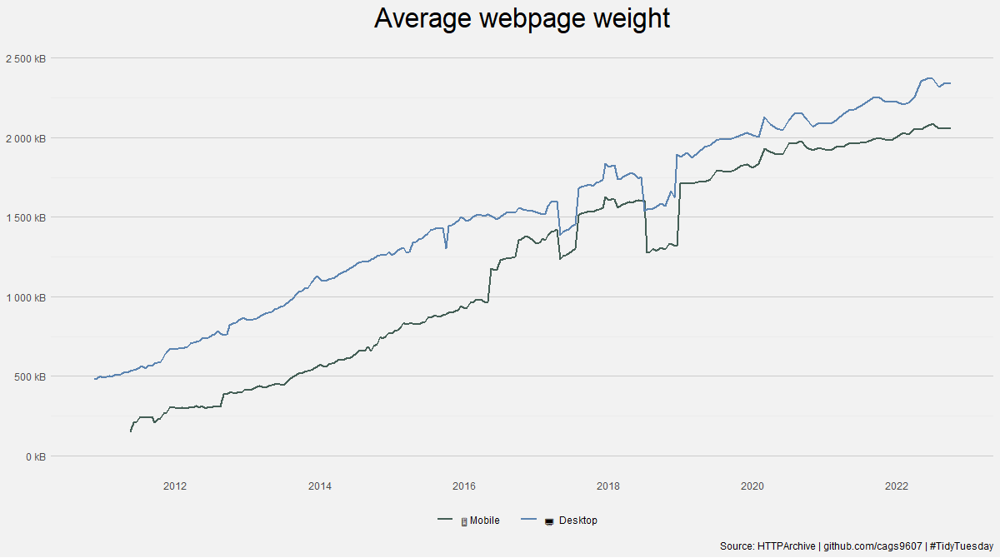
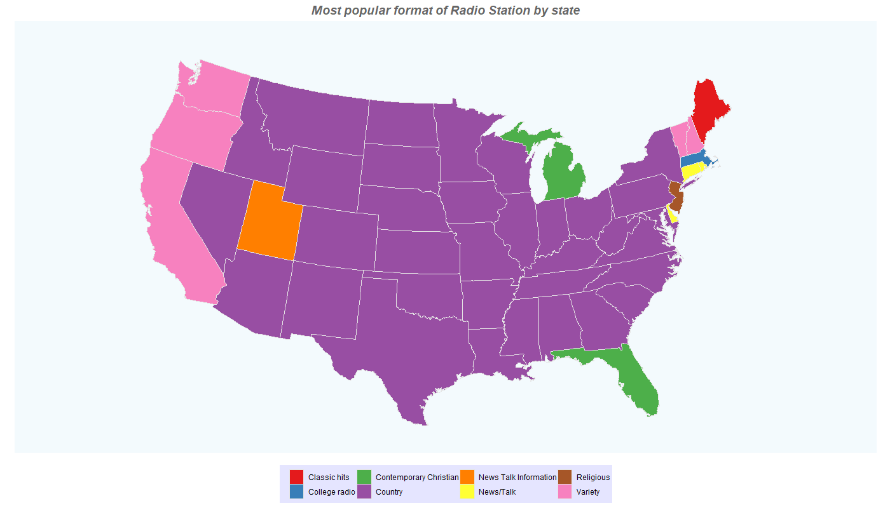

# Tidy-Tuesday (dd/mm/yyyy)

## Web Metrics (15/11/2022) **[code](https://github.com/cags9607/Tidy-Tuesday/blob/master/web-metrics.R)**

<!-- -->

## Radio Stations in the US (08/11/2022) **[code](https://github.com/cags9607/Tidy-Tuesday/blob/master/radio-stations.R)**

<!-- -->

## Friends (08/09/2020) **[code](https://github.com/cags9607/Tidy-Tuesday/blob/master/Friends.R)**

<!-- -->

## Global Crop Yields (01/09/2020) **[code](https://github.com/cags9607/Tidy-Tuesday/blob/master/shiny-markdown-crop.Rmd)** / **[app](https://sergio-carrasco.shinyapps.io/shiny-markdown/)**

<!-- -->

## Chopped (25/08/2020) **[code](https://github.com/cags9607/Tidy-Tuesday/blob/master/Chopped.R)**

<!-- -->

